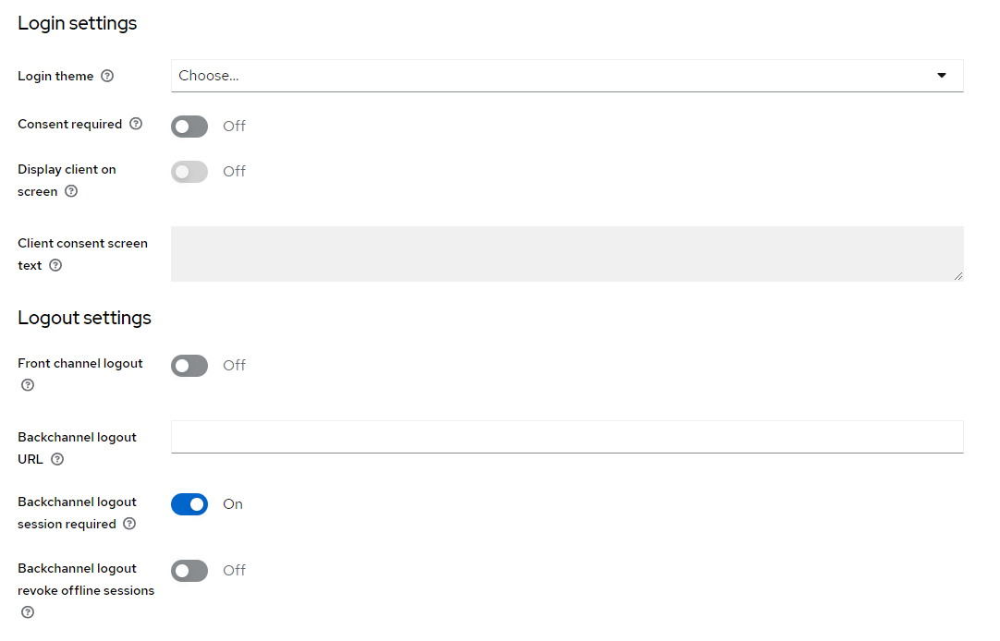

# E-Tourist prerequisites deployment
## Install & Run
You need to:
1. Create a new Google API project with services that needs to be turned on (https://console.cloud.google.com/):
Directions API, Geocoding API, Maps JavaScript API, Places API
2. Clone the repositories below:
    - backend: https://github.com/E-Tourist/backend.git
    - frontend: https://github.com/E-Tourist/frontend.git
    - deployment: https://github.com/E-Tourist/deployment.git
3. Use in terminal:
   From `./deployment` -> `docker-compose -f ./docker-compose.yml --project-name e-tourist up -d --build --force-recreate` to build all services in module
(you can comment out 'backend' and 'frontend' services and run them locally)
4. Get into: http://localhost:8080/auth (Keycloak Admin Console)
5. Login with credentials of: admin/password
6. Configure Keycloak realm:
- create 'E-Tourist' realm and configure it:

- add 'backend', 'frontend' clients:

- create 'admin' and 'user' roles:

- create your own users and assign them into roles

7. Setup both frontend and backend - use clients credentials to authenticate backend, frontend by properties:
- auth server url: http://localhost:8080/auth/
- realm: 'E-Tourist'
- resource/clientId: 'backend' or 'frontend'
- clientSecret: [generated by keycloak] (only backend)

Other parameters if needed:
- bearer-only: true,
- ssl-required: external,
- confidential-port: 443